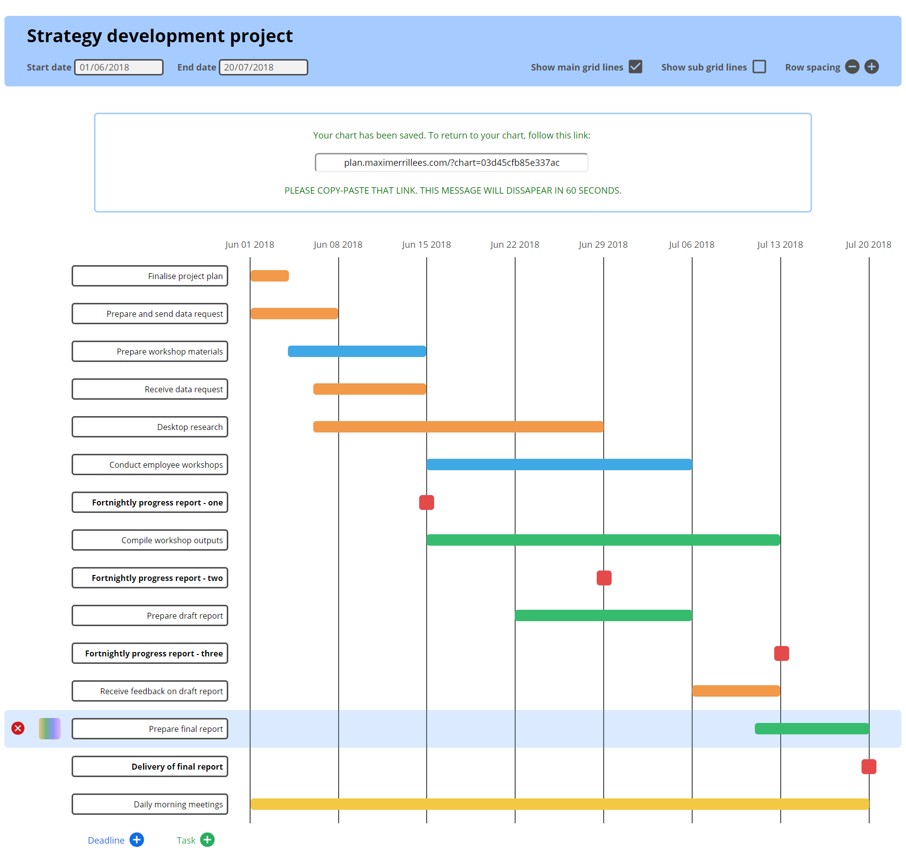

# [plan.maximerrillees.com](http://plan.maximerrillees.com/)

# Context
I built this Gantt chart tool over four days to practice the JavaScript that I had learnt. My goal was to create a nicely designed one-page website that users can interact with. I also wanted to add drag/drop/resize functionality.

The website is built with CSS, HTML and vanilla  JavaScript, with the aid of two libraries for drag, drop and resize functionality:
1. [draggable](https://shopify.github.io/draggable/)
2. [interactjs](http://interactjs.io/)

## Functionality
This website allows users to create Gantt charts. Users are able to build the chart by interacting directly with the elements on the screen, including by resizing the timelines and dragging and dropping the tasks.

This website also connects to a back-end rails app to enable saving. When users click 'save', their chart's data will be sent to the back-end API and saved in a postgres database. Users can reload their website by visiting the link that the API returns.

## Design
I used [figma](https://www.figma.com/) to develop the design. I mostly stuck with the original design but made a few tweaks during development. Here is the original design:

