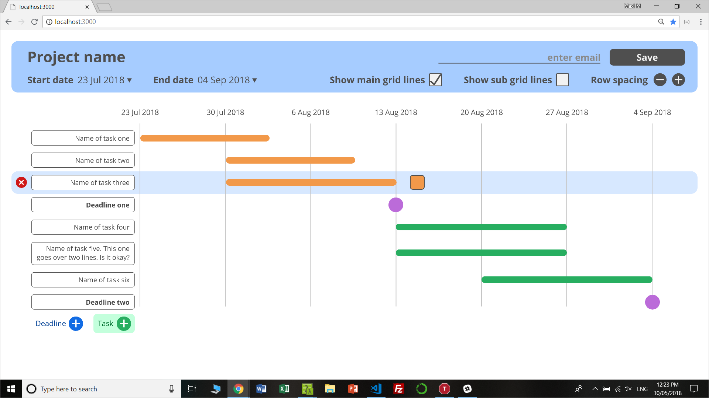

# Context
The purpose of this project is to practice the JavaScript that I've learnt so far. My goal is to create a nicely designed one-page website that users can interact with.

This website will allow users to create a gantt chart. Users should be able to build the chart by interacting directly with the elements on the screen, including by resizing the timelines and dragging and dropping the tasks.

I've designed the website, so now I will build it. I will build the page with HTML, CSS and vanilla JavaScript (because I haven't learnt any JS frameworks yet).

## Proposed Design

# More to come...
More to come...